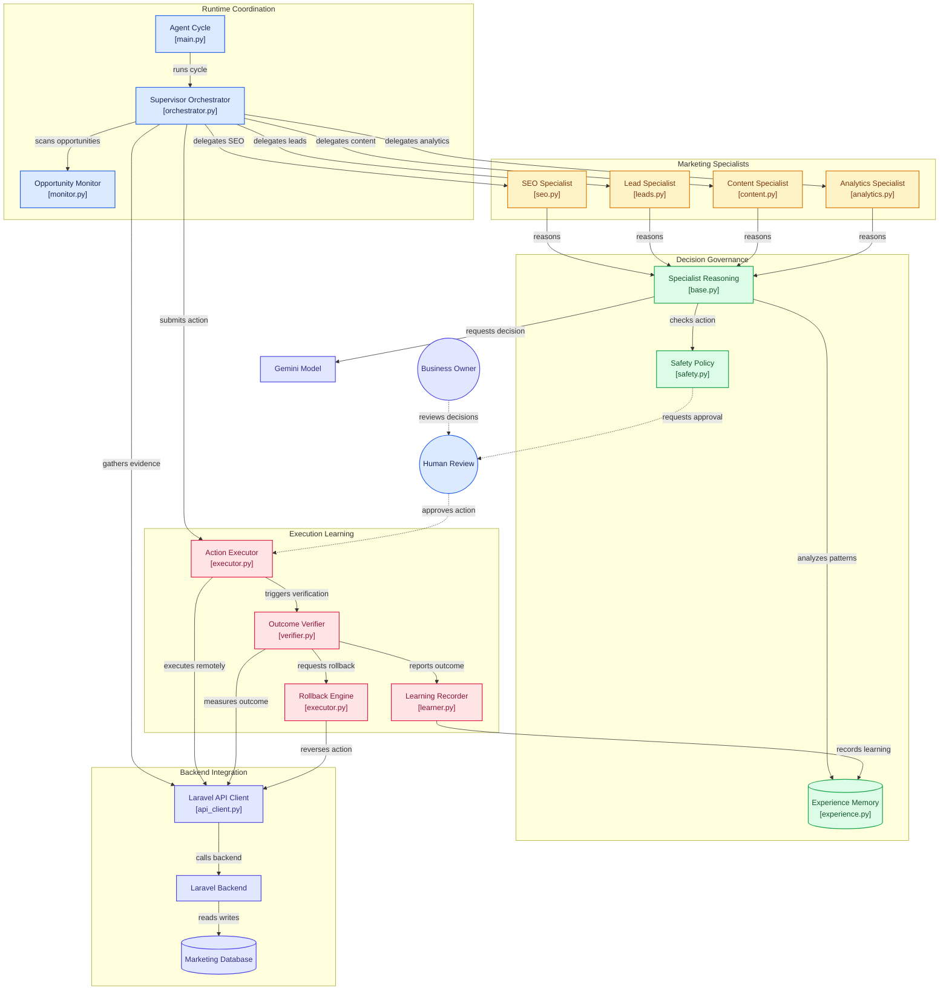

# 🧠 Vumbi AI – Autonomous Marketing Intelligence

[](https://opensource.org/licenses/MIT)
[](https://strandsagents.com)
[](https://deepmind.google/technologies/gemini/)
[](https://agentsforhumans.devpost.com)

> An autonomous, multi‑agent marketing system that monitors opportunities, makes decisions, executes actions, verifies outcomes, and learns — freeing solo founders from busywork.

---

## 🎯 The Problem

Solo founders and small-business owners spend 30%+ of their time on repetitive marketing tasks:

- Checking SEO issues across dozens of pages
- Fixing broken links and missing meta tags
- Following up with leads manually
- Creating consistent content
- Monitoring campaign performance

These tasks are highly judgment-heavy, time-consuming, and drain creative energy. Most founders cannot afford a marketing team, so they either burn out, hire expensive agencies, or stagnate.

**Vumbi AI solves this problem.**

---

## 💡 The Solution

**Vumbi AI** is a hierarchical multi‑agent system written in Python that handles marketing busywork autonomously. It is composed of:

- 🧠 **Supervisor Agent** — orchestrates the workflow and delegates tasks
- 🎯 **Specialist Agents** — SEO, Lead, and Content specialists with domain expertise
- 🔮 **Intelligent Decision Engine** — uses Gemini reasoning together with experience memory
- 🛡️ **Safety Policy** — governs actions with deterministic rules
- ✅ **Verification & Rollback** — confirms outcomes and reverses failures when needed
- 📚 **Experience Memory** — learns from past actions to improve future decisions

The system runs every 15 minutes and only surfaces when human judgment is needed.

---

## 🏗️ Architecture Overview

This system coordinates a supervisor, specialist agents, decision logic, execution, verification, and learning.



---

## 🔄 How It Works

1. **Monitor** — The supervisor scans for SEO issues, pending leads, and content gaps.
2. **Delegate** — The supervisor assigns each opportunity to the right specialist.
3. **Reason** — Each specialist invokes its Strands agent loop, gathering evidence and consulting experience memory.
4. **Decide** — GeminiReasoningService proposes an action with a confidence score.
5. **Govern** — SafetyPolicy checks whether the action is permitted and reversible.
6. **Execute** — The action is executed via the Laravel API or queued for human review.
7. **Verify** — After a wait period, metrics are compared to confirm improvement.
8. **Learn** — The outcome is stored in ExperienceMemory for future decisions.
9. **Rollback** — If verification fails, the action is automatically rolled back.

---

## 🚀 Quick Start

### Prerequisites

- Python 3.10+
- PHP 8.2+ for the Laravel backend
- Google Gemini API key ([Get one here](https://aistudio.google.com/app/apikey))
- MySQL 8.0+

### 1) Clone the Repository

```bash
git clone https://github.com/Dante-VIQ/Autonomous-Agent.git
cd Autonomous-Agent
```

### 2) Create and Activate a Virtual Environment

```bash
python -m venv venv
source venv/bin/activate   # On Windows: venv\Scripts\activate
```

### 3) Install Dependencies

```bash
pip install -r requirements.txt
```

### 4) Configure Environment

```bash
cp .env.example .env
```
Then update `.env` with values similar to:

```env
GEMINI_API_KEY=your_key_here
STRANDS_MODEL_ID=gemini-2.5-flash
LARAVEL_API_URL=http://localhost:8000/api
LARAVEL_API_KEY=your_api_key_here
BRAND_ID=1
AGENT_INTERVAL=900
```
If you prefer to use Ollama locally, set OLLAMA_HOST and OLLAMA_MODEL in .env.

### 5) Run The Agent

```bash
python run.py
```
This starts the agent loop, which will monitor and act on opportunities every AGENT_INTERVAL seconds.

### 6) Development Mode

```bash
python run.py --once   # run a single cycle and exit
```

---

## 🛠️ Tools & Components

| Component               | Purpose                                                                           |
| ----------------------- | --------------------------------------------------------------------------------- |
| Supervisor Agent        | Orchestrates the workflow and delegates tasks using Strands agent logic           |
| SEO Specialist          | Handles meta tags, broken links, rankings, and domain-specific SEO tasks          |
| Lead Specialist         | Scores leads and suggests follow-up actions based on engagement signals           |
| Content Specialist      | Identifies content gaps and generates outlines or content recommendations         |
| IntelligentDecisionTool | Combines Gemini reasoning, memory, and safety policy checks                       |
| GeminiReasoningService  | Performs structured prompting for business decisions and JSON output              |
| ExperienceMemory        | Stores past actions and calculates success patterns for future decisions          |
| SafetyPolicy            | Applies deterministic governance, risk scoring, rate limits, and tenant isolation |
| VerifyTool              | Measures before/after metrics to validate whether an action worked                |
| RollbackEngine          | Reverses failed actions such as content unpublishing or campaign resume           |
| LaravelApiService       | Centralizes backend communication with the Laravel API                            |

---

## 📁 Project Structure

```text
Autonomous-Agent/
├── src/
│   ├── __init__.py
│   ├── main.py                     # Entry point
│   ├── config.py                   # Environment config
│   ├── orchestrator.py             # Core orchestrator
│   ├── executor.py                 # Action executor with retry
│   ├── verifier.py                 # Action‑specific verification
│   ├── learner.py                  # Learning with real storage
│   ├── specialists/
│   │   ├── __init__.py
│   │   ├── base.py                 # BaseSpecialist with reason()
│   │   ├── seo.py                  # SEO specialist
│   │   ├── leads.py                # Lead specialist
│   │   ├── content.py              # Content specialist
│   │   └── analytics.py            # Analytics specialist
│   ├── policies/
│   │   ├── __init__.py
│   │   └── safety.py               # SafetyPolicy
│   ├── memory/
│   │   ├── __init__.py
│   │   └── experience.py           # ExperienceMemory
│   ├── tools/
│   │   ├── __init__.py
│   │   ├── monitor.py              # monitor_opportunities
│   │   └── domain/
│   │       ├── __init__.py
│   │       ├── seo.py
│   │       ├── leads.py
│   │       ├── content.py
│   │       └── analytics.py
│   └── utils/
│       ├── __init__.py
│       ├── api_client.py           # Async Laravel client
│       └── logger.py               # Logging setup
├── tests/
│   ├── __init__.py
│   ├── test_api_client.py
│   └── ...
├── .env.example
├── requirements.txt
├── pyproject.toml
├── README.md
└── run.py
```

---

## 🔐 Security & Governance

- **Tenant Isolation** — Each brand operates in its own context; the LLM never chooses its tenant.
- **Safety Policy** — Actions are rate-limited, risk-assessed, and require approval for high-impact tasks.
- **Human-in-the-Loop** — High-risk or low-confidence actions are queued for human review.
- **Rollback** — All actions are reversible; failed actions are automatically undone.
- **Audit Logging** — Every decision, execution, verification, and rollback is logged.

---

## 🧪 Testing

```bash
# Run all tests
pytest

# Run a single cycle manually
python run.py --once

# Health check (if Laravel backend is running)
curl http://localhost:8000/api/agent/health
```

---

## 🤝 Contributing

1. Fork the repository.
2. Create a feature branch: `git checkout -b feature/amazing-feature`
3. Commit your changes: `git commit -m 'Add amazing feature'`
4. Push to the branch: `git push origin feature/amazing-feature`
5. Open a pull request.

---

## 📄 License

This project is licensed under the MIT License. See the LICENSE file for full details.

---

## 🙌 Acknowledgments

- Strands Agents SDK — Multi-agent orchestration
- Google Gemini — AI model provider
- Laravel — Backend API framework
- AWS — Agents for Humans Hackathon sponsor

---

## 📬 Contact

- Project: https://github.com/Dante-VIQ/Autonomous-Agent
- Hackathon: Agents for Humans 2026
