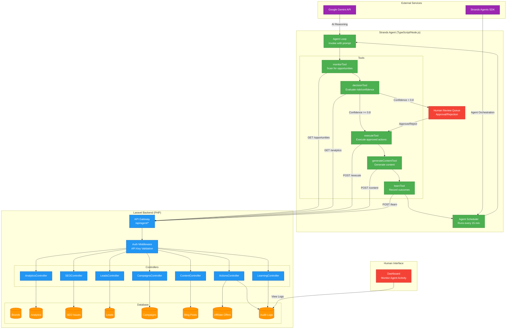

```markdown

## 🏗️ System Architecture


```mermaid
graph TB
    subgraph "External Services"
        GEMINI[Google Gemini API]
        STRANDS[Strands Agents SDK]
    end

    subgraph "Strands Agent (TypeScript/Node.js)"
        direction TB
        A1[Agent Scheduler<br/>Runs every 15 min]
        A2[Agent Loop<br/>Invoke with prompt]
        
        subgraph "Tools"
            T1[monitorTool<br/>Scan for opportunities]
            T2[decisionTool<br/>Evaluate risk/confidence]
            T3[executeTool<br/>Execute approved actions]
            T4[generateContentTool<br/>Generate content]
            T5[learnTool<br/>Record outcomes]
        end
        
        A1 --> A2
        A2 --> T1
        T1 --> T2
        T2 -->|Confidence >= 0.8| T3
        T2 -->|Confidence < 0.8| H1[Human Review Queue]
        T3 --> T4
        T4 --> T5
        T5 --> A1
    end

    subgraph "Laravel Backend (PHP)"
        direction TB
        B1[API Gateway<br/>/api/agent/*]
        B2[Auth Middleware<br/>API Key Validation]
        
        subgraph "Controllers"
            C1[AnalyticsController]
            C2[SEOController]
            C3[LeadsController]
            C4[CampaignsController]
            C5[ContentController]
            C6[ActionsController]
            C7[LearningController]
        end
        
        subgraph "Database"
            D1[(Brands)]
            D2[(Analytics)]
            D3[(SEO Issues)]
            D4[(Leads)]
            D5[(Campaigns)]
            D6[(Blog Posts)]
            D7[(Affiliate Offers)]
            D8[(Audit Logs)]
        end
        
        B1 --> B2
        B2 --> C1 & C2 & C3 & C4 & C5 & C6 & C7
        C1 --> D2
        C2 --> D3
        C3 --> D4
        C4 --> D5
        C5 --> D6
        C6 --> D7 & D8
        C7 --> D8
    end

    subgraph "Human Interface"
        H1[Human Review Queue<br/>Approval/Rejection]
        H2[Dashboard<br/>Monitor Agent Activity]
    end

    %% Connections between systems
    GEMINI -->|AI Reasoning| A2
    STRANDS -->|Agent Orchestration| A1
    
    T1 -->|GET /opportunities| B1
    T2 -->|GET /analytics| B1
    T3 -->|POST /execute| B1
    T4 -->|POST /content| B1
    T5 -->|POST /learn| B1
    
    H1 -->|Approve/Reject| T3
    H2 -->|View Logs| D8

    %% Styling
    classDef agent fill:#4CAF50,color:white,stroke:#2E7D32
    classDef backend fill:#2196F3,color:white,stroke:#0D47A1
    classDef database fill:#FF9800,color:white,stroke:#E65100
    classDef external fill:#9C27B0,color:white,stroke:#4A148C
    classDef human fill:#F44336,color:white,stroke:#B71C1C
    
    class A1,A2,T1,T2,T3,T4,T5 agent
    class B1,B2,C1,C2,C3,C4,C5,C6,C7 backend
    class D1,D2,D3,D4,D5,D6,D7,D8 database
    class GEMINI,STRANDS external
    class H1,H2 human
```