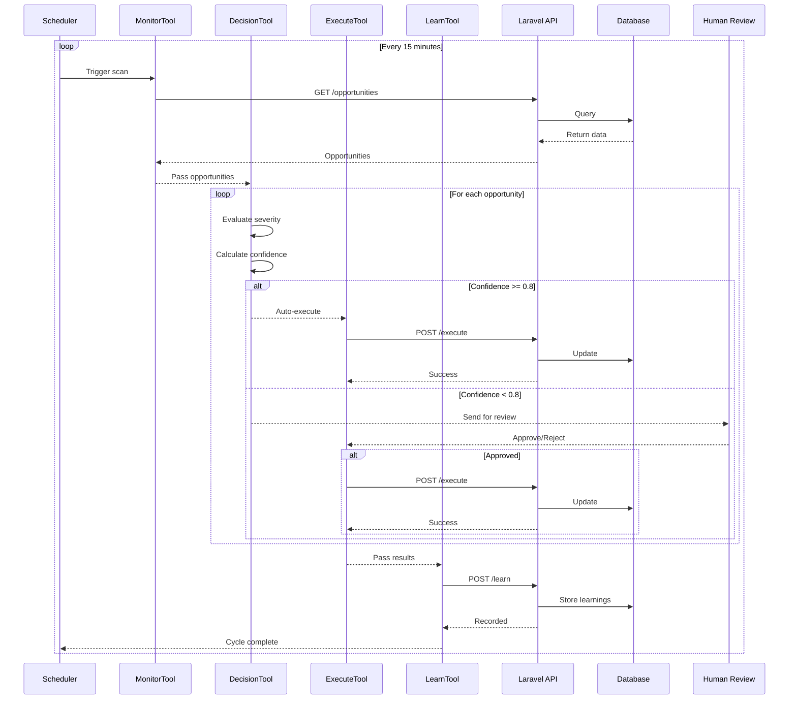

## Data Flow Diagram

```mermaid
sequenceDiagram
    participant S as Scheduler
    participant M as MonitorTool
    participant D as DecisionTool
    participant E as ExecuteTool
    participant L as LearnTool
    participant API as Laravel API
    participant DB as Database
    participant H as Human Review

    loop Every 15 minutes
        S->>M: Trigger scan
        M->>API: GET /opportunities
        API->>DB: Query
        DB-->>API: Return data
        API-->>M: Opportunities

        M-->>D: Pass opportunities

        loop For each opportunity
            D->>D: Evaluate severity
            D->>D: Calculate confidence

            alt Confidence >= 0.8
                D-->>E: Auto-execute
                E->>API: POST /execute
                API->>DB: Update
                API-->>E: Success
            else Confidence < 0.8
                D-->>H: Send for review
                H-->>E: Approve/Reject
                alt Approved
                    E->>API: POST /execute
                    API->>DB: Update
                    API-->>E: Success
                end
            end
        end

        E-->>L: Pass results
        L->>API: POST /learn
        API->>DB: Store learnings
        API-->>L: Recorded
        L-->>S: Cycle complete
    end
```
