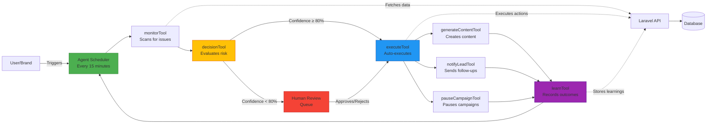

## System Flow Diagram

```mermaid
flowchart LR
    A[User/Brand] -->|Triggers| B[Agent Scheduler<br/>Every 15 minutes]

    B --> C[monitorTool<br/>Scans for issues]
    C --> D[decisionTool<br/>Evaluates risk]

    D -->|Confidence ≥ 80%| E[executeTool<br/>Auto-executes]
    D -->|Confidence < 80%| F[Human Review<br/>Queue]

    E --> G[generateContentTool<br/>Creates content]
    E --> H[notifyLeadTool<br/>Sends follow-ups]
    E --> I[pauseCampaignTool<br/>Pauses campaigns]

    G & H & I --> J[learnTool<br/>Records outcomes]
    J --> B

    C -.->|Fetches data| K[Laravel API]
    E -.->|Executes actions| K
    J -.->|Stores learnings| K

    K --> L[(Database)]

    F -->|Approves/Rejects| E

    style B fill:#4CAF50,stroke:#2E7D32
    style D fill:#FFC107,stroke:#E65100
    style E fill:#2196F3,stroke:#0D47A1
    style J fill:#9C27B0,stroke:#4A148C
    style F fill:#F44336,stroke:#B71C1C
```
